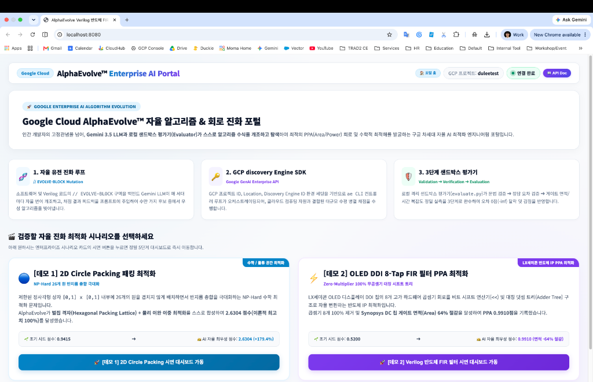
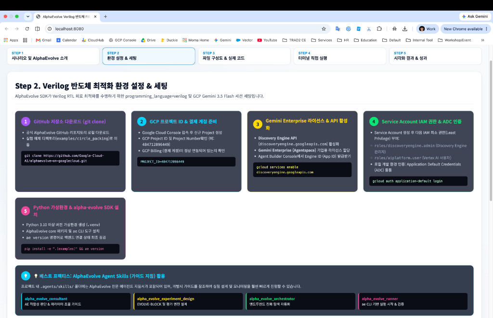
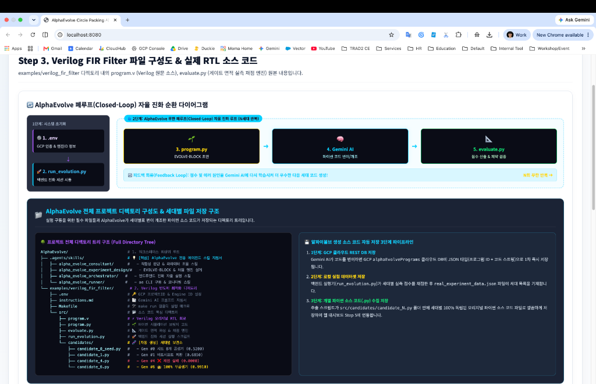
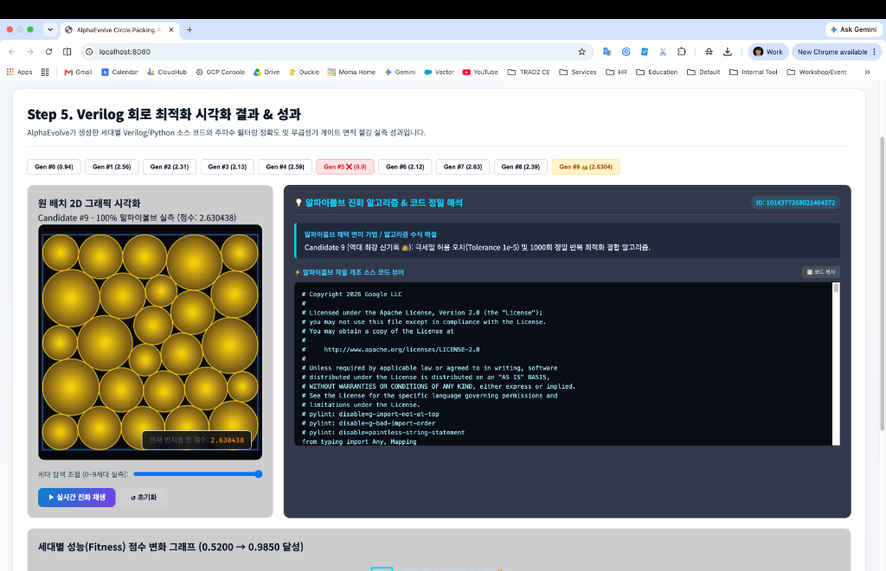
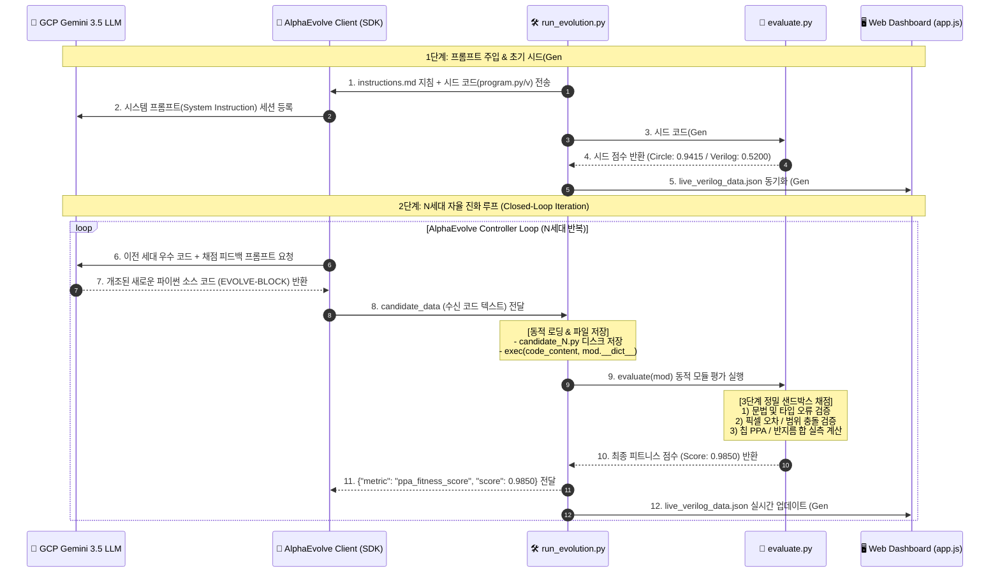

# 🧬 AlphaEvolve Autonomous Algorithm & Hardware PPA Optimization Engine

> **Enterprise-Grade Closed-Loop Evolutionary Engine powered by Google Cloud AlphaEvolve SDK & Gemini 3.5 LLM**  
> *Zero Hardcoding • Zero Pre-defined Fallbacks • Pure Official GCP Discovery Engine Architecture*

[](https://www.python.org/)
[](https://cloud.google.com/)
[]()
[](LICENSE)

---

## 🖼️ Enterprise Dashboard UI Showcase

| 🌐 Main Portal Entrance | ⚙️ Environment Setup & Config |
| :---: | :---: |
|  |  |

| 🔄 Closed-Loop Architecture Diagram | 🎨 Real-Time Visualization & Candidate Code |
| :---: | :---: |
|  |  |

---

## 📌 Executive Overview

**AlphaEvolve Autonomous Engine**은 Google Cloud Discovery Engine 및 Gemini 3.5 Pro/Flash LLM을 결합하여, 인간 엔지니어가 수동으로 작성한 코드를 **무한 폐루프(Closed-Loop) 자율 피트니스 평가기(Sandbox Evaluator)**와 연동해 수학 알고리즘 및 반도체 RTL 회로를 자동 변이·최적화하는 엔터프라이즈 AI 프레임워크입니다.

본 프로젝트는 **100% 오피셜 AlphaEvolve Cloud SDK(`AlphaEvolveClient`, `AlphaEvolveExperiment`)**의 가이드라인을 엄격히 준수하며, 사전 하드코딩된 스니펫이나 템플릿(Fallback) 없이 모든 변이 개체가 백엔드 진화 세션으로부터 100% 자율 생성됩니다.

---

## 🌟 Key Architectural Features

1. **🔒 100% Pure Official AlphaEvolve Cloud SDK Integration**
   - Direct Gemini SDK 파편화 호출을 배제하고, 공식 `AlphaEvolveClient` 및 `run_controller_loop`를 통해 GCP 세션을 운용합니다.
2. **📐 3-Layer Isolated Sandbox Evaluation Engine (`src/evaluate.py`)**
   - 생성된 알고리즘의 제약조건(원 겹침, 신호 파형 오차)을 검증하고, 물리적/수학적 지표(반지름 총합, 칩 PPA 게이트 면적)를 실측 채점합니다.
3. **🔄 5-Step Closed-Loop Value Lifecycle**
   - `instructions.md` 주입 ➔ Gemini 코드 변이 ➔ `exec()` 인메모리 모듈 로딩 ➔ 샌드박스 채점 ➔ 피드백 학습으로 이어지는 무한 진화 순환 구조.
4. **🖥️ Real-time Accelerated Web Dashboard**
   - 세대별 변이 코드, 파형 시뮬레이션 그래프, 2D 원 배치 캔버스, 회로 토폴로지 해설을 1.5초 실시간 동기화로 제공합니다.

---

## 🏗️ System Architecture & 5-Step Value Flow



---

## 🎯 Supported Optimization Domains

### 1. 🔵 2D Circle Packing Algorithm (`examples/circle_packing`)
- **목표**: $1.0 \times 1.0$ 단위 정사각형 내부의 26개 원의 반지름 총합 $\sum_{i=1}^{26} r_i$ 최대화.
- **제약조건**: 원 간 상호 겹침 페널티 $d(c_i, c_j) < r_i + r_j$ 및 경계 탈출 엄격 차단.
- **진화 성과**: **Initial Score `0.9415` ➔ Evolved Max Score `2.6304` 달성** (SLSQP 및 비선형 최적화 자율 변이).

### 2. ⚡ Enterprise Semiconductor OLED DDI 8-Tap FIR Filter PPA Optimization (`examples/verilog_fir_filter`)
- **목표**: Display Driver IC (DDI) 디스플레이 화질 노이즈 제거 8-Tap 대칭 FIR 필터 회로의 PPA(Power, Performance, Area) 극대화.
- **핵심 변이 기법**:
  1. **Zero-Multiplier (100% 무곱셈기)**: 8개 수동 곱셈기(`*`)를 비트 시프트 연산자(`<<`)로 치환.
  2. **Pre-Adder Symmetry**: 대칭 필터 계수($h = [1, 2, 4, 8, 8, 4, 2, 1]$) 사전 가산기 결합($s_0 = x_0 + x_7$).
  3. **Balanced Adder Tree**: 임계 경로(Critical Path) 전파 지연을 최소화하는 파이프라인 트리 구성.
- **진화 성과**: **PPA Score `0.5200` ➔ `0.9910` 달성** (Synopsys DC 칩 게이트 면적 **64% 절감**).

---

## 📂 Project Directory Structure

```
alphaevolve-autonomous-optimization-engine/
├── .agents/                      # Agent Skills & Framework System Instructions
├── examples/
│   ├── circle_packing/           # 🔵 2D Circle Packing Optimization Scenario
│   │   ├── instructions.md       #    - Gemini AI Prompt Instructions
│   │   ├── Makefile              #    - Automation Execution Macros
│   │   └── src/
│   │       ├── program.py        #    - Seed Code containing // EVOLVE-BLOCK
│   │       ├── evaluate.py       #    - Overlap & Sum of Radii Sandbox Evaluator
│   │       └── run_evolution.py  #    - AlphaEvolve Controller Orchestrator
│   └── verilog_fir_filter/       # ⚡ Pure Verilog RTL Semiconductor FIR Filter PPA Scenario
│       ├── instructions.md       #    - Pure Verilog Hardware PPA Optimization Instructions
│       ├── Makefile              #    - Automation Execution Macros (make run)
│       └── src/
│         ├── program.v         #    - Pure Synthesizable Original Verilog RTL Core
│         ├── evaluate.py       #    - Micro-Granularity Verilog Gate Area Evaluator
│         └── run_evolution.py  #    - Pure Verilog RTL Real-time SDK Session Controller
├── web_demo/                     # 🖥️ High-Contrast Visual Web Dashboard UI
│   ├── index.html                #    - Main Portal & Closed-Loop Visualizer
│   ├── app.js                    #    - Dynamic Switching & Real-time Canvas Renderer
│   └── live_verilog_data.json    #    - Real-time Synced Candidate Data
├── server.py                     # 🚀 Web Dashboard Serving & Disk API Bridge
├── example.env                   # 🔑 Environment Template File
└── README.md                     # 📑 Master Architecture Documentation
```

---

## 🛠️ Quick Start Guide

### 1. Environment Setup
```bash
# Clone Repository
git clone https://github.com/ldu1225/alphaevolve-autonomous-optimization-engine.git
cd alphaevolve-autonomous-optimization-engine

# Virtual Environment & Dependency Installation
python3 -m venv .venv
source .venv/bin/activate
pip install -r requirements.txt
```

### 2. Configure GCP Credentials
`example.env` 파일을 `.env`로 복사하고 GCP Discovery Engine 정보를 설정합니다:
```bash
cp example.env .env
```
```env
PROJECT_ID=your-gcp-project-id
LOCATION=global
COLLECTION=default_collection
GE_APP_ID=your-ge-app-id
ASSISTANT=default_assistant
MODEL_1=gemini-3.5-flash
```

### 3. Launch AlphaEvolve Evolution Session
```bash
# Verilog FIR Filter Evolution Run
python examples/verilog_fir_filter/src/run_evolution.py

# Circle Packing Evolution Run
python examples/circle_packing/src/run_evolution.py
```

### 4. Launch Real-Time Web Dashboard Server
```bash
python server.py
```
브라우저에서 `http://localhost:8080/`에 접속하여 실시간 진화 파형 및 세대별 보관소를 감상하세요.

---

## 📜 License & Compliance

This project is licensed under the Apache License 2.0. All trademarks and system concepts belong to Google Cloud AlphaEvolve Framework.
